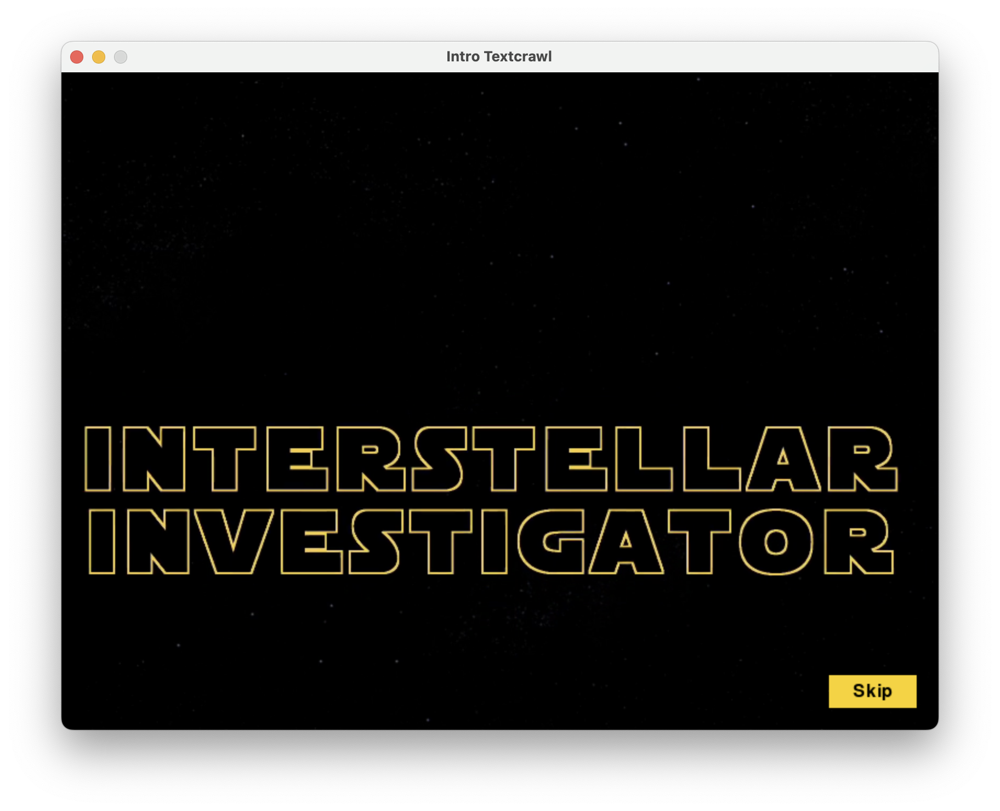
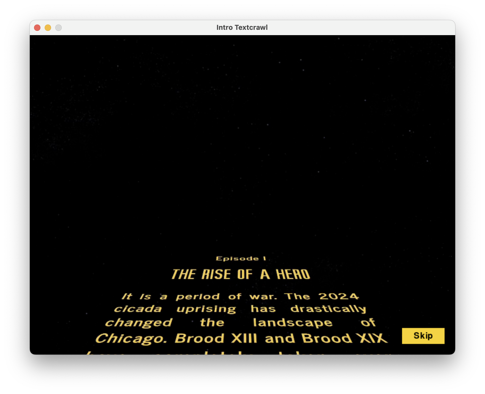
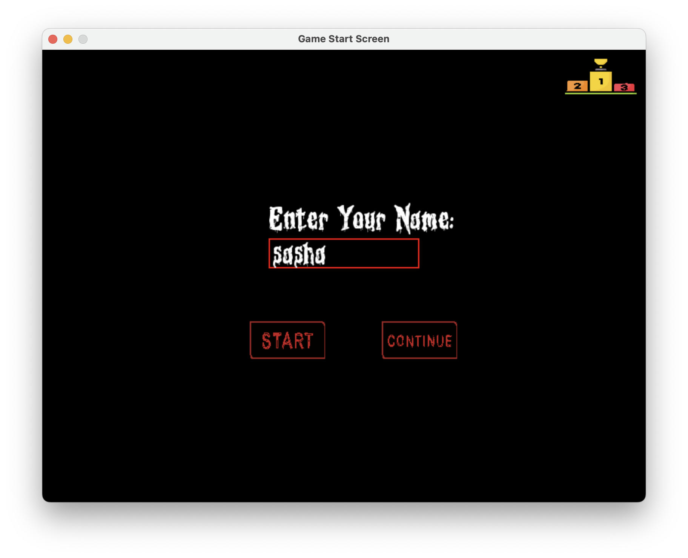
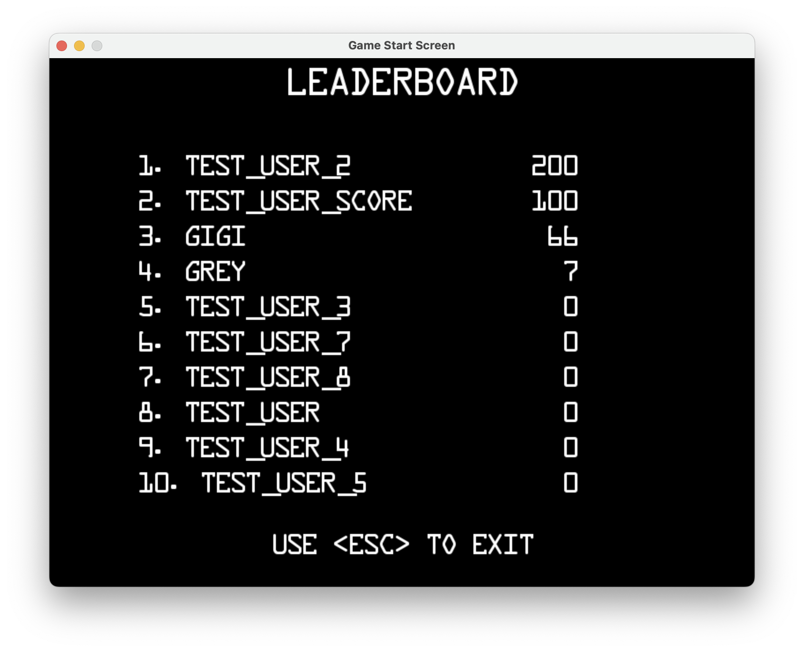
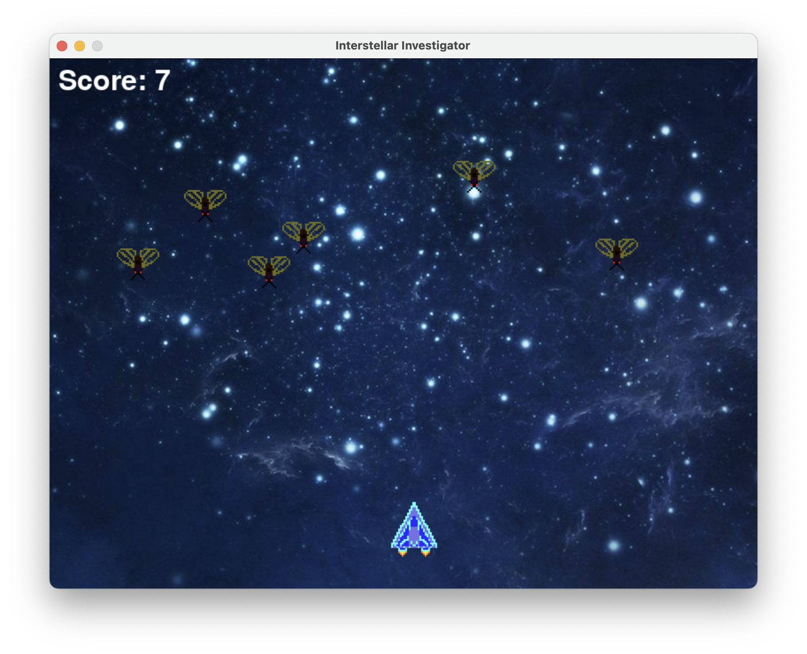
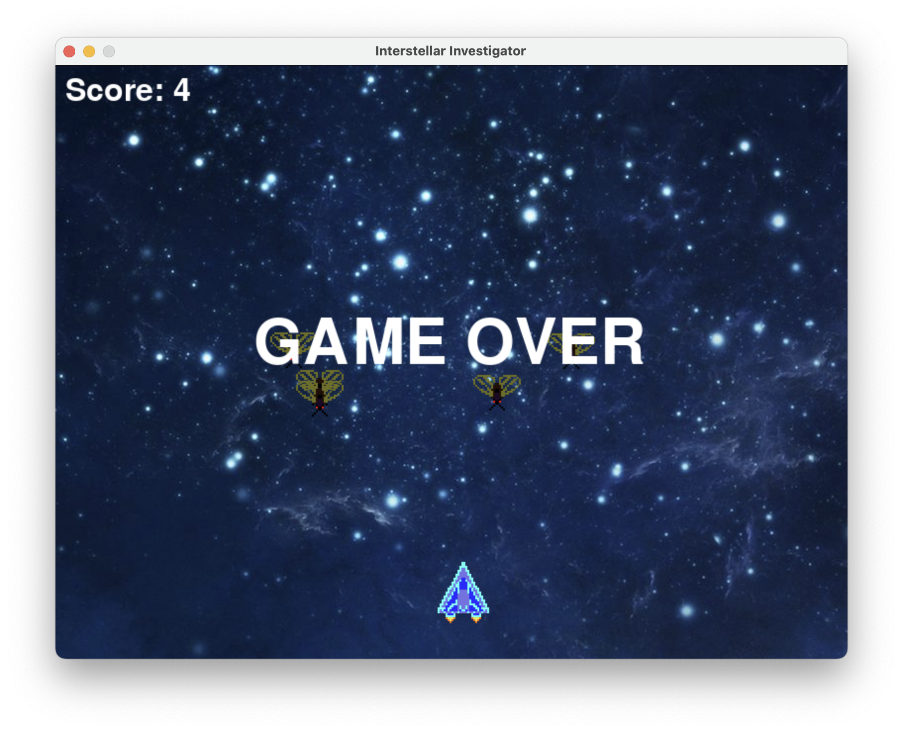

# interstellar-investigator
After the 2024 cicada uprising, it's you against the bugs. Welcome to
Interstellar Investigator: a game where action meets mystery.
Can you survive the onslaught?

Team members:
- Sanjay Sakthivel (sanjay872)
- Gigi Hu (hongzhi5)
- Vignesh Ram (kuttivicky)
- Sasha Rolfe (sasha-rolfe)
- Xiaoqing Mei (xmei12)

Libraries:
- pygame
- pymongo
- sys
- random
- math
- unittest
- cv2

Other:
- kassellabs.io
- piskelapp.com
- opengameart.org
- chosic.com

Screenshots:   

